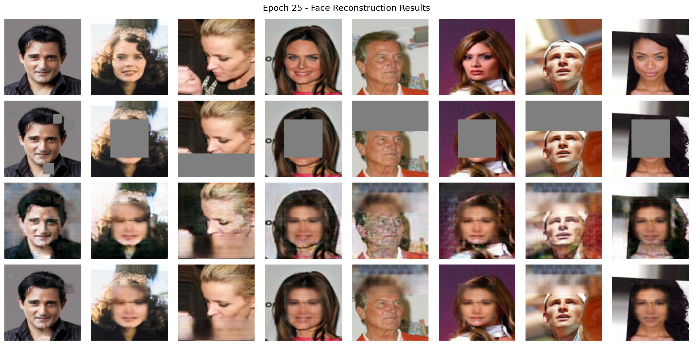
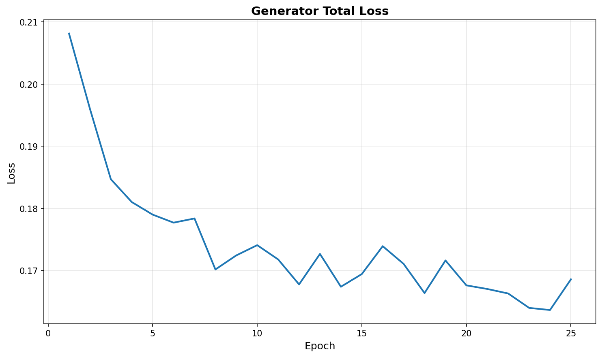
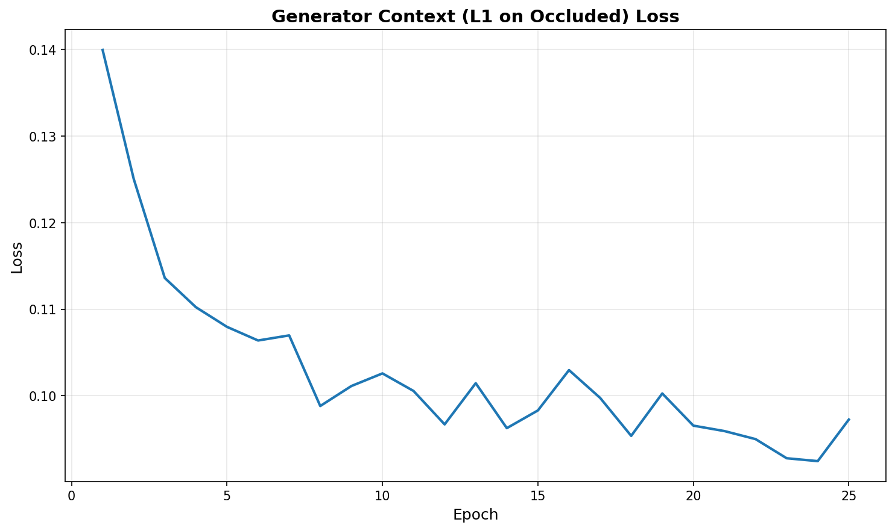
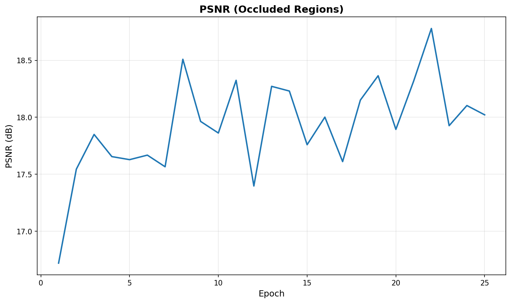
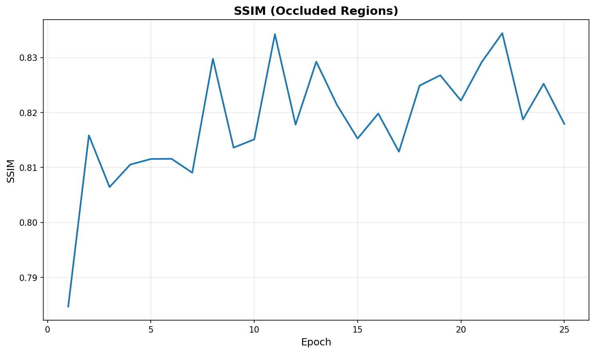

# Identity-Preserving Face Reconstruction under Occlusion using Generative Adversarial Networks

A deep learning framework for restoring occluded facial images using Generative Adversarial Networks with identity-aware supervision.

## Overview

This repository implements a GAN-based approach to reconstruct facial regions hidden by masks, glasses, or other obstructions. The model combines pixel-level reconstruction with semantic identity preservation to generate realistic and identity-consistent facial completions.

## Key Features

- **Context Encoder Architecture**: Encoder-decoder generator design for semantic facial inpainting
- **PatchGAN Discriminator**: Local patch-based adversarial training for enhanced texture realism
- **Identity-Aware Loss**: Embedding-level supervision using pretrained face recognition networks
- **Multi-Objective Training**: Balanced optimization across reconstruction, adversarial, and identity losses
- **Flexible Occlusion Handling**: Supports various masking patterns including center, half-face, eye-region, and mouth-region occlusions

## Architecture

The framework consists of three main components:

1. **Generator (Context Encoder)**
   - Encoder: Downsampling convolutional layers with LeakyReLU activation
   - Bottleneck: Compact semantic feature representation
   - Decoder: Upsampling transposed convolutions with ReLU activation

2. **Discriminator (PatchGAN)**
   - Evaluates local image patches rather than entire images
   - Enforces high-frequency texture consistency
   - Reduces parameter count while improving realism

3. **Identity Branch**
   - Frozen ResNet50-based face recognition model
   - Computes embedding distance between reconstructed and original faces
   - Ensures semantic consistency in feature space


*Complete architecture showing generator, discriminator, and identity loss computation*

## Repository Structure

```
├── images/                          # Architecture diagrams and visualizations
│   ├── gan_architecture.png
│   └── epoch_0025.png
├── output/                          # Training loss curves and metrics
│   ├── 1_discriminator_loss.png
│   ├── 2_generator_total_loss.png
│   ├── 3_generator_adversarial_loss.png
│   ├── 4_generator_context_loss.png
│   ├── 5_generator_identity_loss.png
│   ├── 6_psnr.png
│   └── 7_ssim.png
├── data_preparation.py              # Dataset loading and occlusion generation
├── face_reconstruction_gan.py       # Model architecture definitions
├── metrics.py                       # Evaluation metrics (PSNR, SSIM)
└── train.py                         # Training loop and optimization
```

## Requirements

```bash
python >= 3.8
torch >= 1.10.0
torchvision >= 0.11.0
numpy
pillow
matplotlib
scikit-image
```

## Installation

```bash
git clone https://github.com/amilbek/face-reconstruction-gan.git
cd face-reconstruction-gan
pip install -r requirements.txt
```

## Dataset Preparation

The model is trained on the CelebA dataset. Download and prepare the data:

```bash
# Download CelebA from official source
# Place aligned images in ./data/celeba/img_align_celeba/
```

The `data_preparation.py` script handles:
- Image loading and normalization
- Synthetic occlusion mask generation
- Train/validation split (80/20)
- Data augmentation pipeline

## Training

Run the training script with default hyperparameters:

```bash
python train.py
```

### Key Hyperparameters

- `--epochs`: Number of training epochs (default: 25)
- `--batch_size`: Batch size (default: 64)
- `--lr_g`: Generator learning rate (default: 2e-4)
- `--lr_d`: Discriminator learning rate (default: 5e-5)
- `--lambda_rec`: Reconstruction loss weight (default: 0.8)
- `--lambda_adv`: Adversarial loss weight (default: 0.1)
- `--lambda_id`: Identity loss weight (default: 0.1)

### Loss Function

The generator is optimized using a weighted combination of three objectives:

```
L_G = λ_rec * L_rec + λ_adv * L_adv + λ_id * L_id
```

Where:
- **L_rec**: L1 pixel-wise reconstruction loss over occluded regions
- **L_adv**: Binary cross-entropy adversarial loss
- **L_id**: L2 distance in face recognition embedding space

## Evaluation

Reconstruction quality is measured using:
- **PSNR** (Peak Signal-to-Noise Ratio): Pixel-level fidelity
- **SSIM** (Structural Similarity Index): Perceptual similarity

Run evaluation on the validation set:

```bash
python metrics.py --checkpoint path/to/model.pth
```

## Results

The model achieves the following performance on CelebA validation set:

| Metric | Without Identity Loss | With Identity Loss |
|--------|----------------------|-------------------|
| PSNR   | 17.63 dB            | 18.02 dB          |
| SSIM   | 0.8067              | 0.8179            |

### Visual Results


*Sample reconstructions at epoch 25. From top to bottom: ground truth, masked input, generator output, final reconstruction*

Sample reconstructions demonstrate:
- Smooth blending between visible and generated regions
- Preservation of global facial structure
- Maintenance of identity-specific features
- Stable adversarial training without mode collapse

### Training Dynamics

<p align="center">
  
  
</p>

<p align="center">
  
  
</p>

<p align="center">
  
</p>
*Loss curves showing stable convergence throughout training*

### Reconstruction Quality Metrics

<p align="center">
  
  
</p>
*PSNR and SSIM evolution over training epochs*

## Usage Example

```python
import torch
from face_reconstruction_gan import Generator
from PIL import Image
import torchvision.transforms as transforms

# Load model
generator = Generator()
generator.load_state_dict(torch.load('checkpoints/generator_epoch25.pth'))
generator.eval()

# Prepare image
transform = transforms.Compose([
    transforms.Resize((128, 128)),
    transforms.ToTensor(),
    transforms.Normalize((0.5, 0.5, 0.5), (0.5, 0.5, 0.5))
])

# Load occluded image
img = Image.open('path/to/occluded_face.jpg')
img_tensor = transform(img).unsqueeze(0)

# Generate reconstruction
with torch.no_grad():
    reconstructed = generator(img_tensor)

# Combine visible and reconstructed regions
mask = create_occlusion_mask(128, 128, occlusion_type='center')
final_output = img_tensor * mask + reconstructed * (1 - mask)
```

## Future Work

- Direct evaluation on downstream face recognition tasks
- Extension to higher-resolution images (256×256, 512×512)
- Integration of perceptual losses (VGG, LPIPS)
- Real-world occlusion detection and removal pipeline
- Multi-scale discriminator architecture
- Attention mechanisms for better context encoding

## Contact

For questions or collaboration opportunities:
- Email: N.Amilbek@astanait.edu.kz
- GitHub: [@amilbek](https://github.com/amilbek)
